## 1. Título actividad: Actividad 1 - Configuración y Pruebas de Proyecto Spring Boot
Estudiante: Miguel Ángel Muñoz López

## 2. Instancia de base de datos

La instancia de Prisma.io no es pública.
Se adjunta evidencia mediante captura de pantalla.

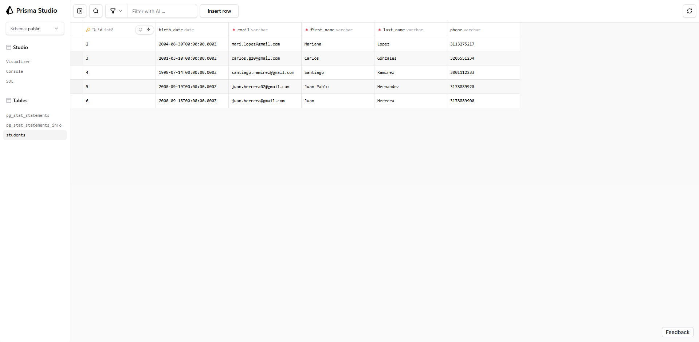

## 3. Conexión en prisma
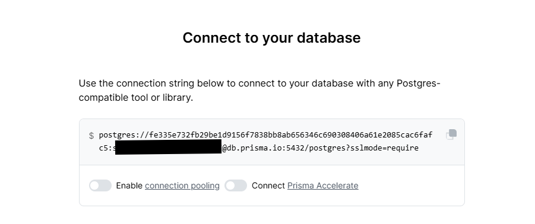

## 4. Log consola Spring Boot y ejecución del proyecto

La aplicación inicia correctamente. Establece una conexión exitosa con la base de datos PostgreSQL en prisma.
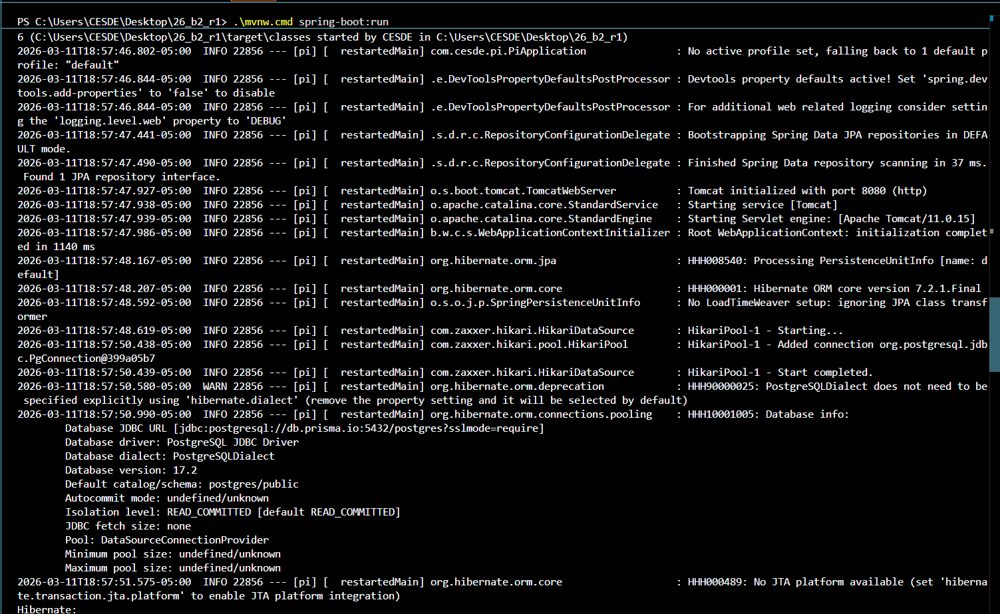

## 5. Evidencias CRUD

## POST
Creación de 3 estudiantes:
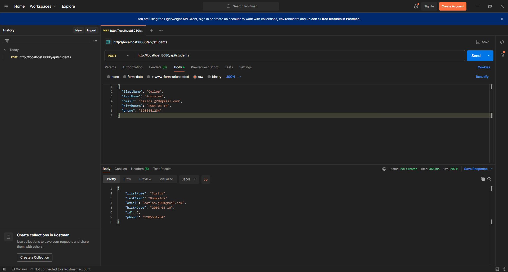
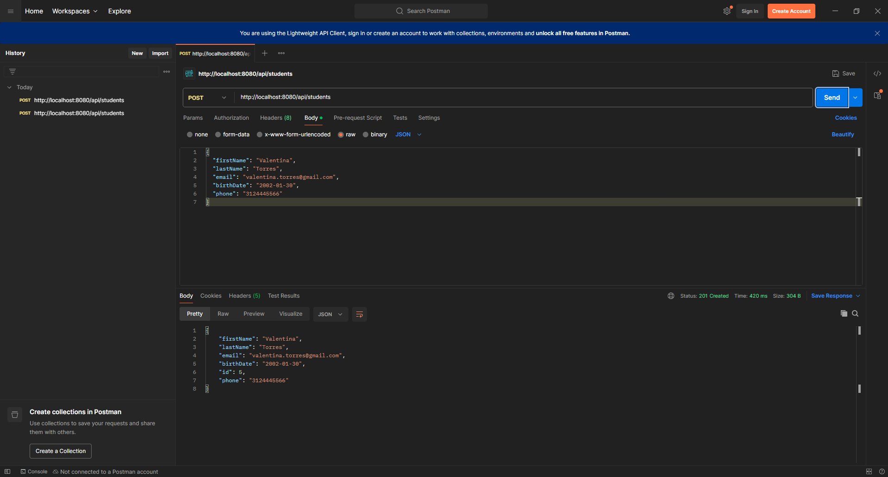
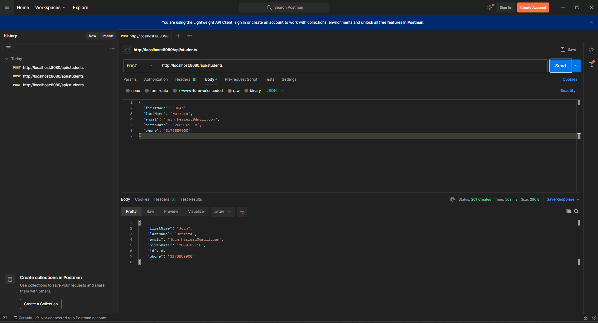

## GET ALL
Se muestran los estudiantes registrados
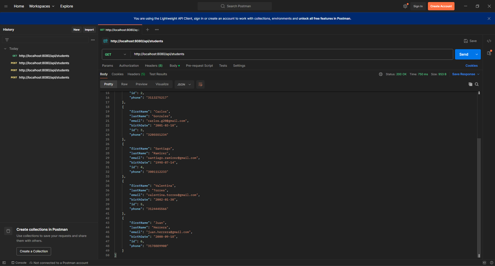

## GET ID
Muestra estudiante por su respectivo ID
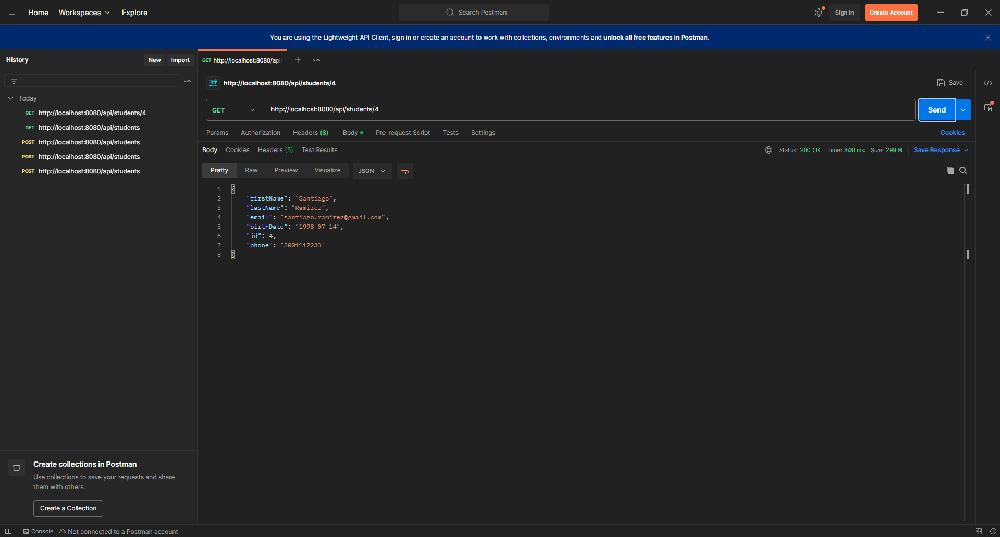

## GET EMAIL
Muestra estudiante por su respectivo correo
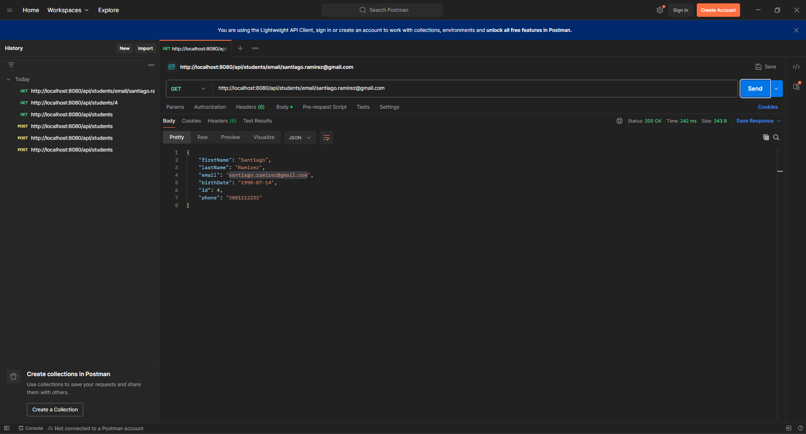

# PUT
Actualiza la información de cada estudiante
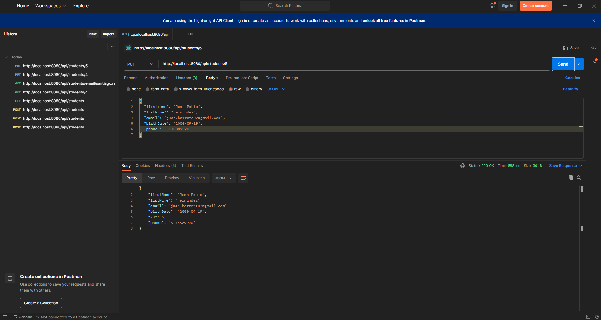

## DELETE
Se eliminó a un estudiante de los creados
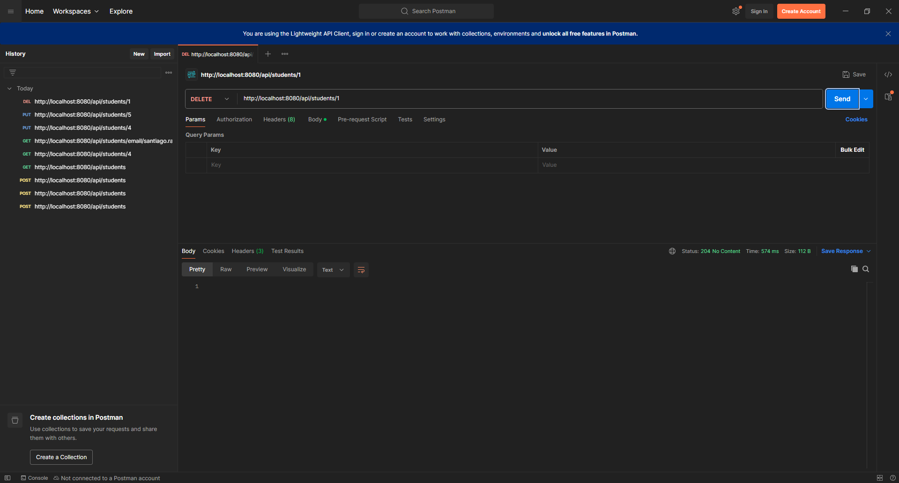

## 6. Captura de pantalla resultado pruebas internas
Se ejecuta comando './mvnw test', donde se verifica que las pruebas unitarias y de integración se realizan de manera exitosa y pasan.
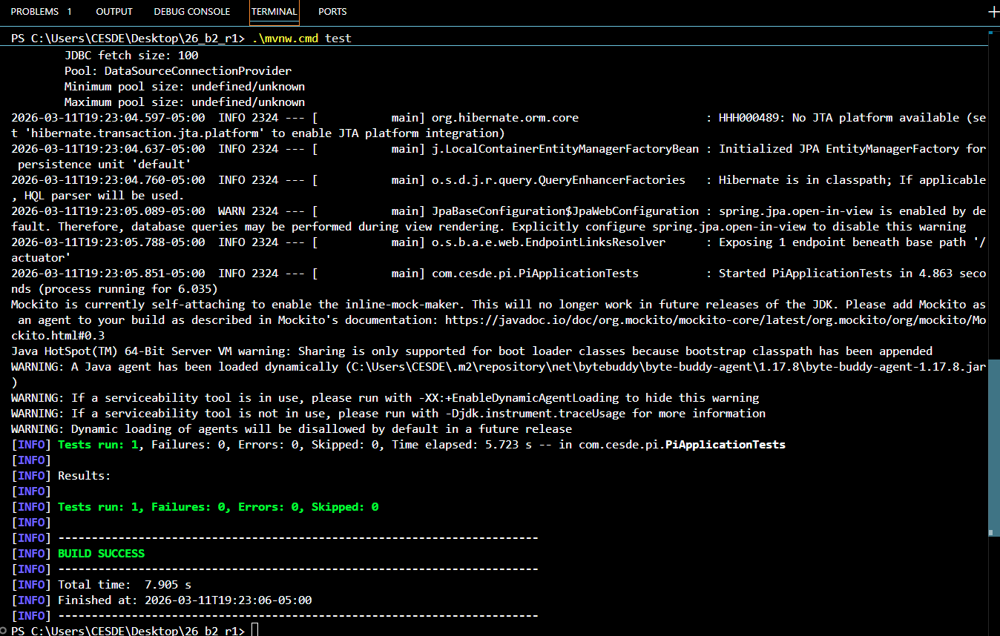